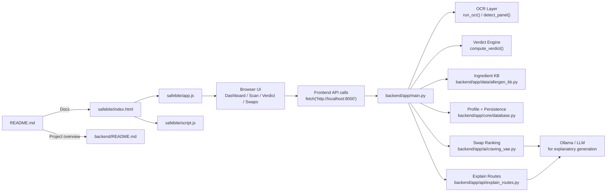

# SafeBite

SafeBite is a food-safety and allergen-awareness web app that helps users scan packaged food labels, understand ingredients, and make better decisions based on their personal dietary profile. The app combines a lightweight browser frontend with a Python/FastAPI backend for OCR, verdict evaluation, ingredient explanations, and swap recommendations.

This repository contains both the frontend experience and the backend service that powers the scanning workflow.

## Why this project matters

Food labels are crowded, technical, and often inconsistent. People with allergies, sensitivities, or preference-driven diets need a tool that can:

- read ingredient text from a product photo,
- compare it against a personal profile,
- call out risky or ambiguous ingredients in plain language,
- explain what a label term means,
- suggest alternative products or swaps.

SafeBite is designed for that workflow: it is a practical proof-of-concept for safer shopping, clearer ingredient understanding, and more informed decision-making.

## What the project does

SafeBite helps users:

- upload or capture a product image,
- extract ingredient text from the label using OCR,
- classify the result as safe, flagged, or unclear,
- review ingredient explanations tailored to the user's profile,
- browse ranked alternative products or swaps,
- track history of scans and product checks.

The app is structured around a real, simple scan flow:

1. User uploads a food label image.
2. Backend processes the image and reads text.
3. Verdict engine compares result against allergen profile.
4. Frontend shows product verdict and ingredient details.
5. User can review swaps and maintain a personal health profile.

## Project architecture



## Interactive codebase explorer

Use these quick links to jump directly to the most important parts of the repo:

| Area | Description | Link |
| --- | --- | --- |
| Frontend entry | Main HTML app shell | [safebite/index.html](safebite/index.html) |
| App logic | Browser flow for scan, verdict, swaps, and ingredient pages | [safebite/app.js](safebite/app.js) |
| Shared frontend helpers | Utilities and shared browser behavior | [safebite/script.js](safebite/script.js) |
| Backend API | Core FastAPI app and routes | [backend/app/main.py](backend/app/main.py) |
| Explain routes | LLM-powered ingredient and swap explanation endpoints | [backend/app/api/explain_routes.py](backend/app/api/explain_routes.py) |
| Core config | App settings, CORS, and environment configuration | [backend/app/core/config.py](backend/app/core/config.py) |
| Data layer | Ingredient KB and domain data | [backend/app/data](backend/app/data) |
| Backend docs | Setup and implementation notes | [backend/README.md](backend/README.md) |
| Root docs | Project overview | [README.md](README.md) |

### Jump directly into the key runtime files

- [Scan flow API](backend/app/main.py)
- [OCR and verdict logic](backend/app/main.py#L156-L230)
- [Frontend dashboard & scan actions](safebite/app.js)
- [Frontend stylesheet](safebite/style.css)
- [Backend requirements](backend/requirements.txt)
- [Demo environment config](backend/env)

## Core features

- OCR-based ingredient extraction with Tesseract
- Rule-based verdict engine for safety checks
- Personal allergen profile support
- Ingredient explanations in plain language
- Swap ranking for flagged or uncertain products
- Web frontend for scan, verdict, and history tasks
- FastAPI JSON API design intended to replace mock data cleanly

## Stack

### Frontend

- HTML, CSS, JavaScript
- Browser-based single-page UX for scan flow and product pages
- Static pages under the `safebite/` directory

### Backend

- Python 3
- FastAPI
- Pydantic models
- OCR via `pytesseract` and `Pillow`
- Optional LLM integration via Ollama / LangChain
- Test suite with `pytest`

## Repository layout

```text
.
├── .gitignore
├── backend/
│   ├── README.md
│   ├── app/
│   │   ├── ai/
│   │   ├── api/
│   │   ├── core/
│   │   ├── data/
│   │   ├── schemas/
│   │   └── main.py
│   ├── env
│   ├── pytest.in
│   ├── requirements.txt
│   └── tests/
├── safebite/
│   ├── app.js
│   ├── app-data.js
│   ├── app.css
│   ├── script.js
│   ├── style.css
│   ├── index.html
│   ├── dashboard.html
│   ├── scan.html
│   ├── verdict.html
│   ├── ingredient-detail.html
│   ├── swaps.html
│   ├── history.html
│   ├── results.html
│   ├── settings.html
│   ├── architecture.html
│   ├── about.html
│   ├── login.html
│   ├── onboarding-allergens.html
│   ├── craving-search.html
│   ├── how-it-works.html
│   └── assets/
└── README.md
```

## How it works

### Frontend flow

The `safebite/` app is a browser-based experience with pages like:

- [index.html](safebite/index.html) — landing experience
- [dashboard.html](safebite/dashboard.html) — scan history and product overview
- [scan.html](safebite/scan.html) — camera/file upload path
- [verdict.html](safebite/verdict.html) — product result summary
- [ingredient-detail.html](safebite/ingredient-detail.html) — ingredient explanation details
- [swaps.html](safebite/swaps.html) — alternative product recommendations

The frontend uses JavaScript to make requests to the FastAPI backend via `fetch()`.

### Backend flow

The Python backend is centered around [backend/app/main.py](backend/app/main.py) and provides the API contract that the frontend expects. The main logic includes:

- image upload endpoint for label scans,
- OCR extraction from uploaded product images,
- verdict assessment against a user profile,
- ingredient lookup and explanation,
- swap search and ranking based on flagged ingredients or craving query.

The backend keeps the API response shapes intentionally aligned with the existing mock data so the frontend can transition from mock data to live API data without major rewrites.

## Getting started

### Prerequisites

Before you start, make sure you have:

- Python 3.10+
- pip
- Tesseract OCR installed locally
- An Ollama instance if you want AI-generated explanations enabled

### 1) Clone the repo

```bash
git clone https://github.com/Jasmine0987/safebite.git
cd safebite
```

### 2) Set up the backend

```bash
cd backend
python -m venv .venv
source .venv/bin/activate   # Windows: .venv\Scripts\activate
pip install -r requirements.txt
```

### 3) Install Tesseract

#### macOS

```bash
brew install tesseract
```

#### Ubuntu / Debian

```bash
sudo apt-get update
sudo apt-get install -y tesseract-ocr
```

#### Windows

Install Tesseract from the official Windows build and ensure it is added to your PATH.

### 4) Run the API

```bash
cd backend
uvicorn app.main:app --reload --host 0.0.0.0 --port 8000
```

The API will be available at:

- `http://localhost:8000`
- `http://localhost:8000/docs` for interactive FastAPI docs

### 5) Run the frontend

Because the frontend is static HTML/JS, you can serve it locally from the repo root or from the `safebite/` directory.

Example:

```bash
cd safebite
python -m http.server 8080
```

Then open:

- `http://localhost:8080/index.html`

If the frontend calls the backend from `localhost:8000`, ensure the backend is running first.

## Environment and configuration

The backend includes a sample environment file at [backend/env](backend/env):

```env
APP_ENV=development
LLM_PROVIDER=ollama
OLLAMA_MODEL=llama3.2
```

This is a minimal setup for local development. If you are running the AI explanations flow, ensure Ollama is installed and the model is downloaded.

Example:

```bash
ollama pull llama3.2
```

## API overview

The backend exposes routes including:

- `POST /api/scan` — upload a label image and get a verdict
- `GET /api/scans` — list recent scans
- `GET /api/scans/{scan_id}` — fetch a specific scan
- `GET /api/ingredient/{ingredient_id}` — fetch ingredient detail
- `GET /api/profile` — fetch user allergen profile
- `POST /api/profile` — update the profile
- `GET /api/swaps/{scan_id}` — generate swaps for a scanned product
- `GET /api/swaps?q=` — search swaps by craving or keyword
- `GET /health` — health check endpoint

The backend is intentionally shaped to match the mock data used by the frontend, which makes it easier to migrate from demo data to live data without changing the UI contract drastically.

## Usage examples

### Example: scan a product label

```bash
curl -X POST "http://localhost:8000/api/scan" \
  -F "file=@/path/to/product-label.jpg"
```

### Example: fetch scan history

```bash
curl "http://localhost:8000/api/scans"
```

### Example: get ingredient detail

```bash
curl "http://localhost:8000/api/ingredient/red40"
```

### Example: search swap suggestions

```bash
curl "http://localhost:8000/api/swaps?q=craving%20for%20chips"
```

## Key implementation notes

This repo is intentionally a practical prototype and includes a few areas marked as future work:

- Panel detection is still a placeholder and currently uses the whole image
- Ingredient explanations are driven by data-backed rules and supporting knowledge
- OCR is real but lightweight and may benefit from stronger product-label optimization
- AI explanation routes rely on Ollama and are optional rather than required for core scanning

The code comments and backend README explain the intended architecture and where the real model integrations should be added.

## Support and help

Need help or want to understand the project better? These are the best starting points:

- [backend/README.md](backend/README.md)
- [safebite/index.html](safebite/index.html)
- [FastAPI docs](http://localhost:8000/docs) once the backend is running
- [GitHub Issues](https://github.com/Jasmine0987/safebite/issues)

If you run into setup issues, start by checking:

- whether Tesseract is installed,
- whether the backend is running on port 8000,
- whether Ollama is available if you are using AI explanation routes.

## Maintainers and contribution

This project is maintained by the repository owner, Jasmine0987.

Contributions are welcome via pull requests or by opening an issue for bugs, enhancements, or documentation improvements.

Before submitting changes:

- keep the app structure and API contracts consistent,
- test backend behavior with the existing `pytest` setup,
- make sure the frontend still works with the current backend expectations,
- provide clear, concise notes for any changes affecting scanning, allergy logic, or user profile behavior.

## License

A license file was not found in the repository snapshot reviewed for this README, so no specific license metadata is claimed here. If you are preparing a release or publishing the project publicly, confirm the license before redistribution.

## Summary

SafeBite is a browser and backend-powered food-label checker designed to make safety decisions easier for people managing allergies, sensitivities, and ingredient preferences. It combines OCR, user profiles, explainable ingredient logic, and swap recommendations into a single streamlined workflow for everyday decision-making.

If you are evaluating this repo for local development, the fastest path is:

```bash
cd backend
pip install -r requirements.txt
uvicorn app.main:app --reload --host 0.0.0.0 --port 8000
```

Then in a second terminal:

```bash
cd safebite
python -m http.server 8080
```

Open `http://localhost:8080/index.html` and begin scanning labels.
